# How To Use StarMask

> Assuming you have [installed StarMask extension in Google Chrome](./how-to-install.md).

## 1. Check Account1's Address,PublickKey,and PrivateKey
- a. Click `Account Options` on the right side of account name，choose `Account details` in the pop window
    
    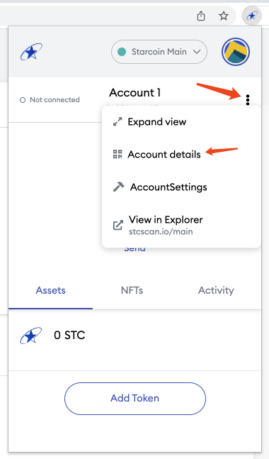

- b. View Address(QR code), PublicKey, ReceiptIdentifer, and export PrivateKey

    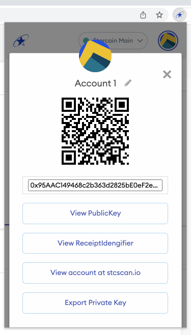

## 2. Import Account2 through private key
- a. Click the circle image on the right-top corner, choose `Import Account` in the pop window

    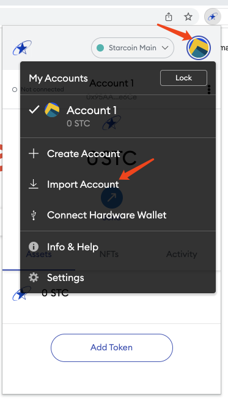

- b. Paste private key, click  `Import`

    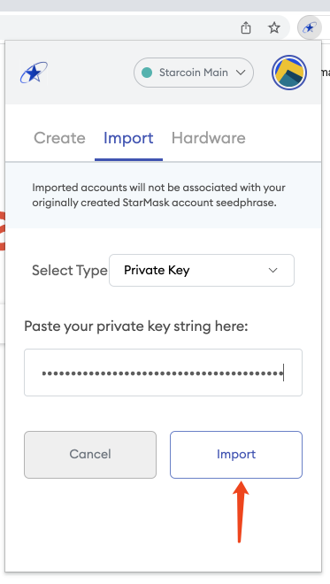

- c. Account2 is imported successfully

    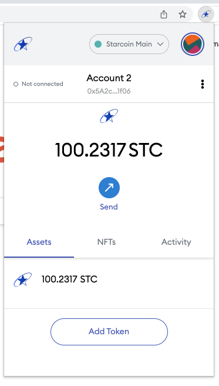

- d. Switch btween multi accounts

    

## 3. Account2 send 1 STC to Account1

- a. Switch to Account2, click `Send`

    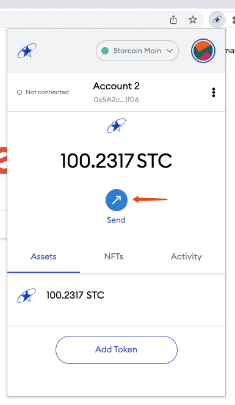

- b. Paste Account1's address or receiptIdentifier(see 1b) in the text input box, 
    
    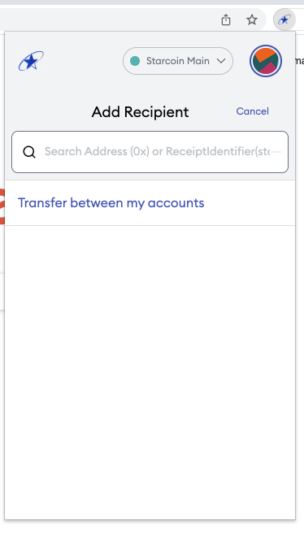

    or, click `Transfer between my accounts`, then choose Account1 in the list

    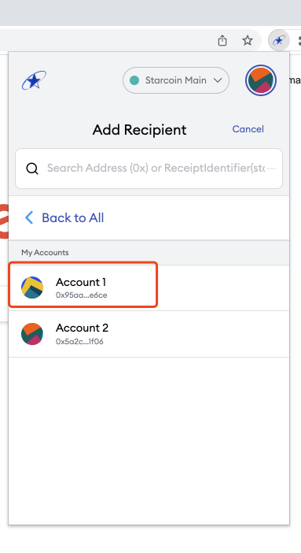

- c. in the next send page,

    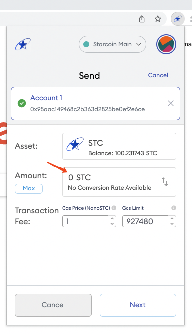

- d. modify Amount from 0 STC to 1 STC, click `Next`

    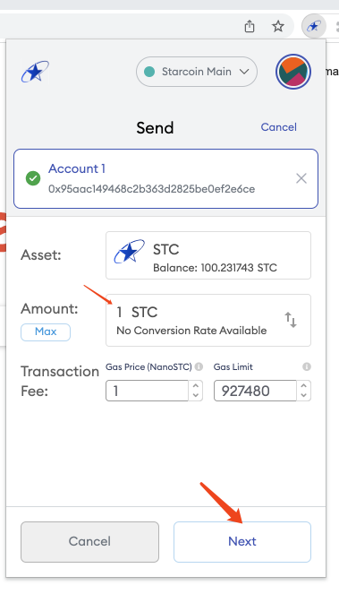

- e. in the next page, click `Confirm`

    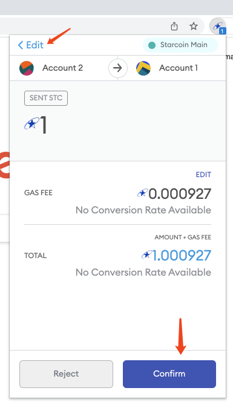

> Tips: Click `Edit`, then go back to previous page to modify amount or gas fee

- f. One pending transaction will be added in the `Activity` tab

    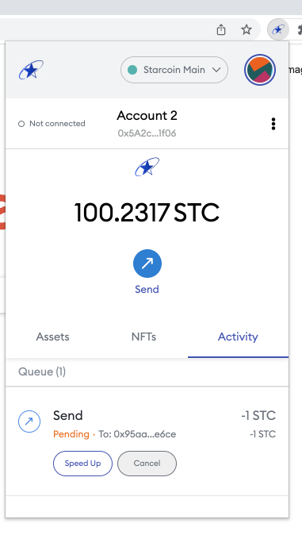

- g. Wait a few seconds/minutes, a system alert will notify wether the transaction is successful or failed

    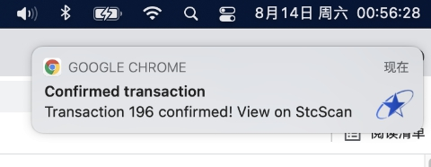
    
    > Tips:  in MacOS,  go to `System Preferences` -> `Notifications & Focus`, 
    > 
    > choose `Google Chrome`, enable `Allow Notifications`
    
    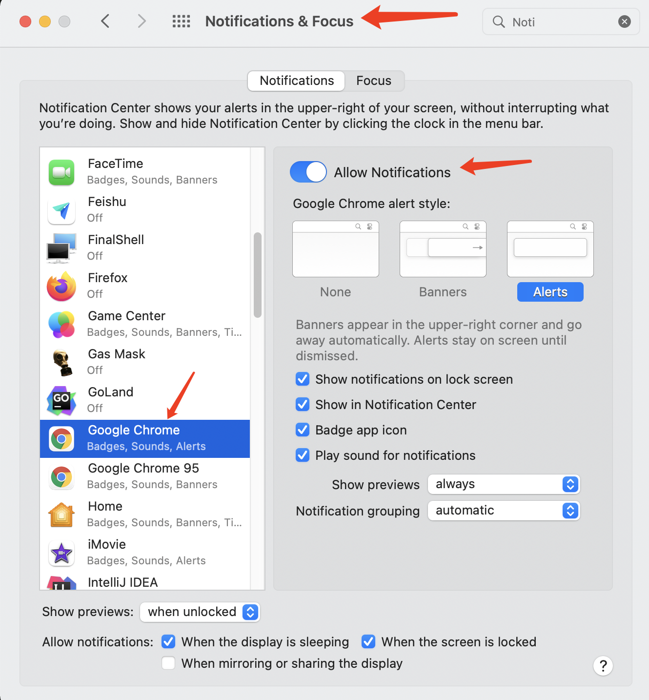
- h. After the tranaction is confirmed, Account2's balance will  be deducted by 1 STC

    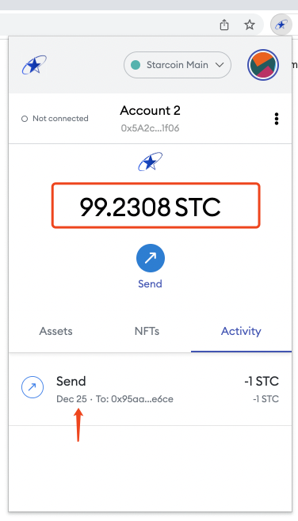

- i. Click the item in the Activity list, will popup a window, display the transaction details.

    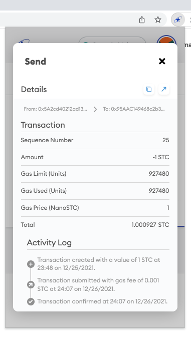

- j. Swith to Account1, the balance will be 1 STC

    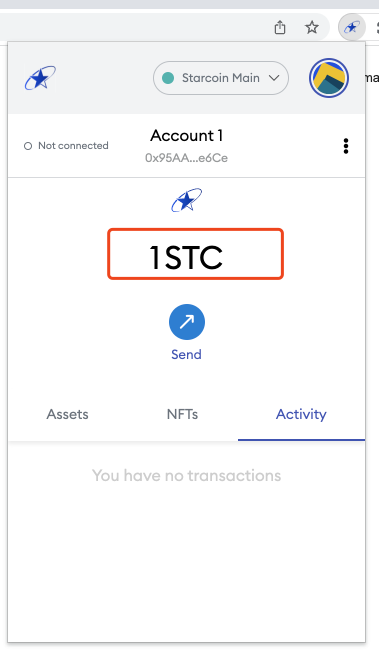

## 4. Others
- a. Settings -> General -> Current Language

    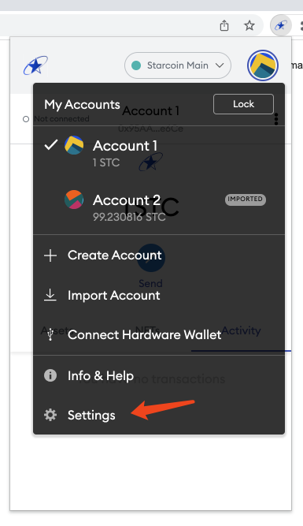

    

- b. Lock/Unlock

    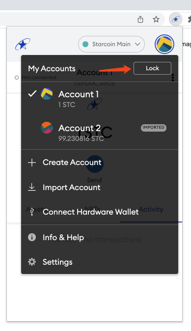

    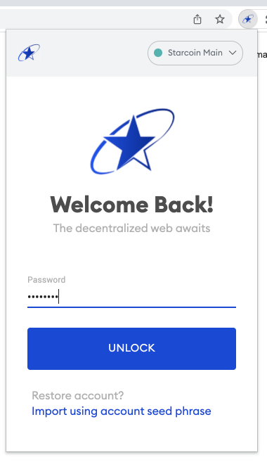

- c. Switch networks

    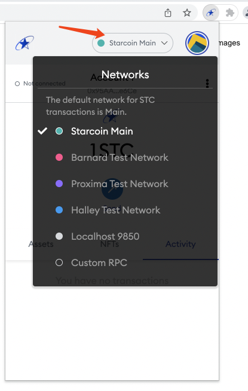
