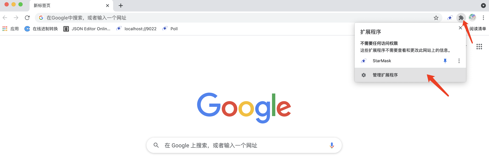
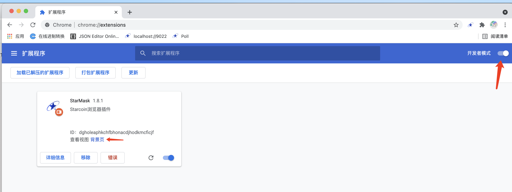
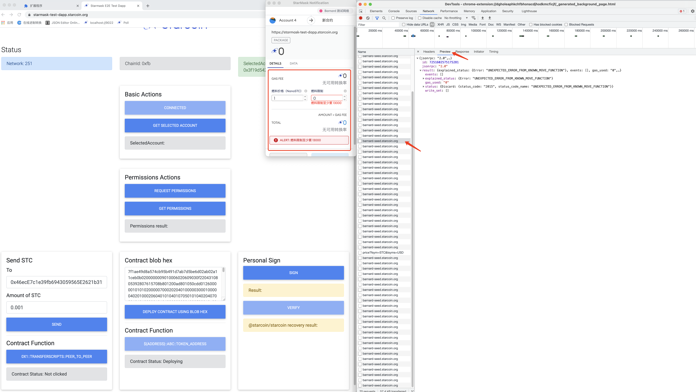

# Chrome调试指南

### 1. 管理扩展程序 
    

### 2. 切换 开发者模式 开关 到 开启，

* 点击 Starmask 插件的  背景页

    

* 或者 在 Starmask 插件的 详细信息 里 点击  背景页

    

    

### 3. 在dapp上跟钱包交互(1,2)，就会在 背景页 的 Network tab(3) 看到很多 XHR 请求(4)

### 4. 如果发现钱包有报错，在 背景页 挨个查看 XHR 请求， 在 Headers - Request Paylod 可以看到api请求的 method 和 params

### 5. 在 Preview 和  Response 可以查看 api请求返回的错误详情

