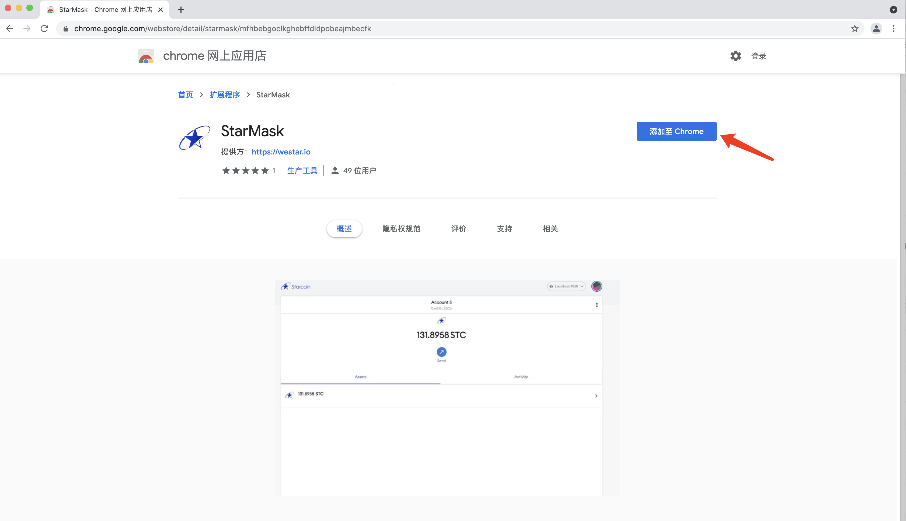
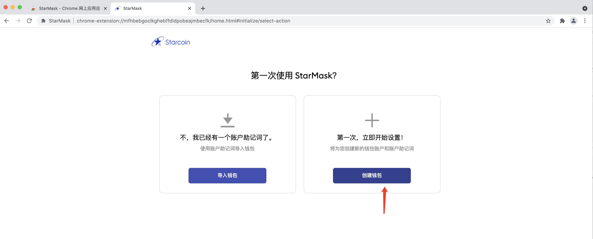
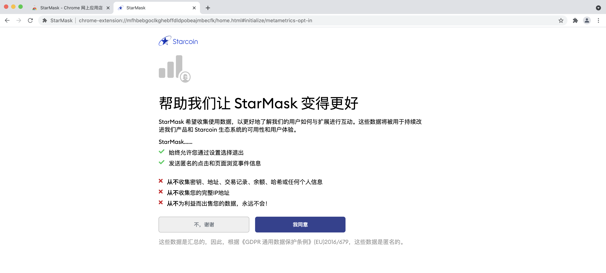
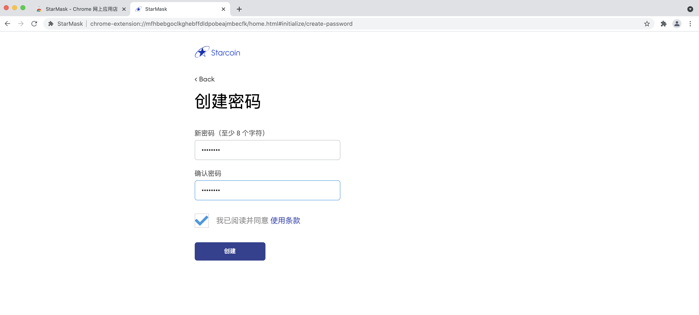
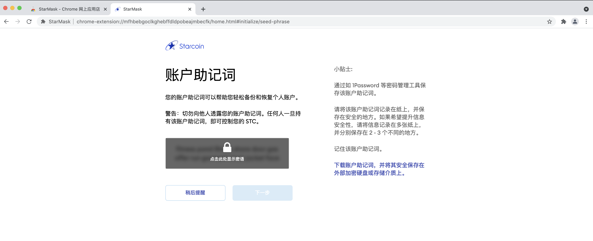
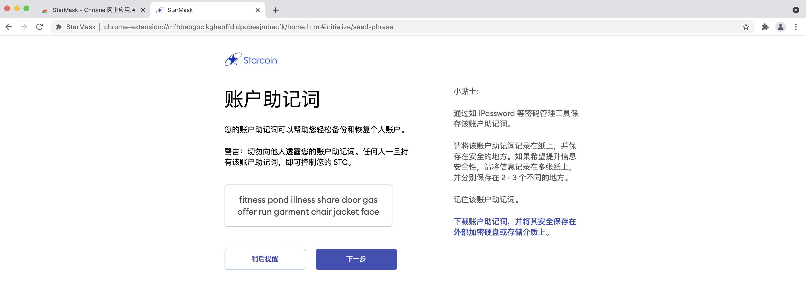
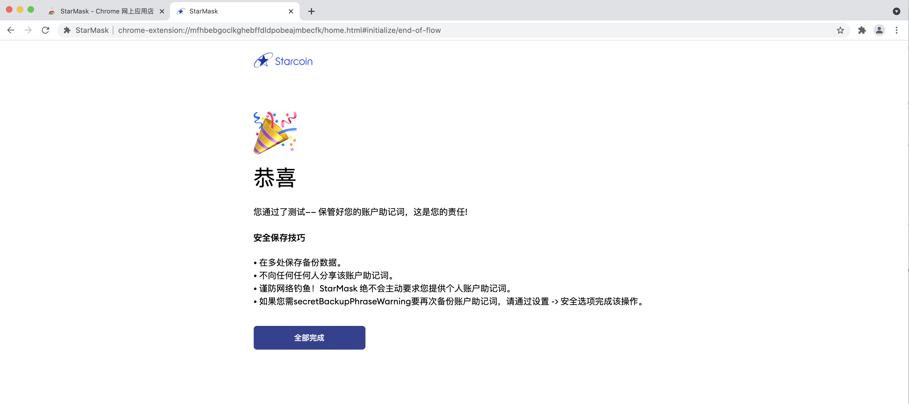
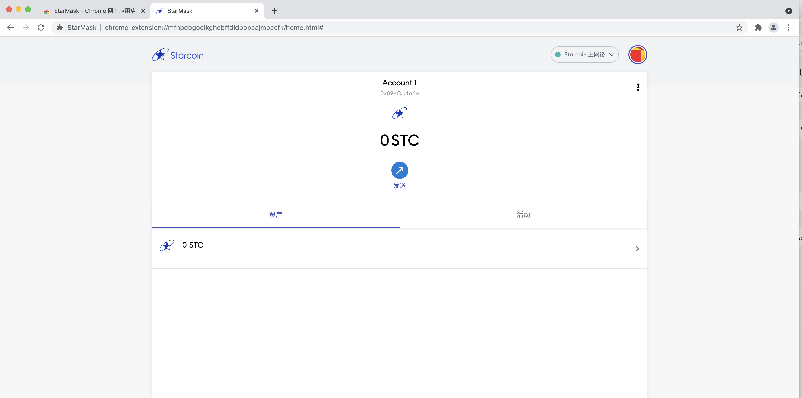
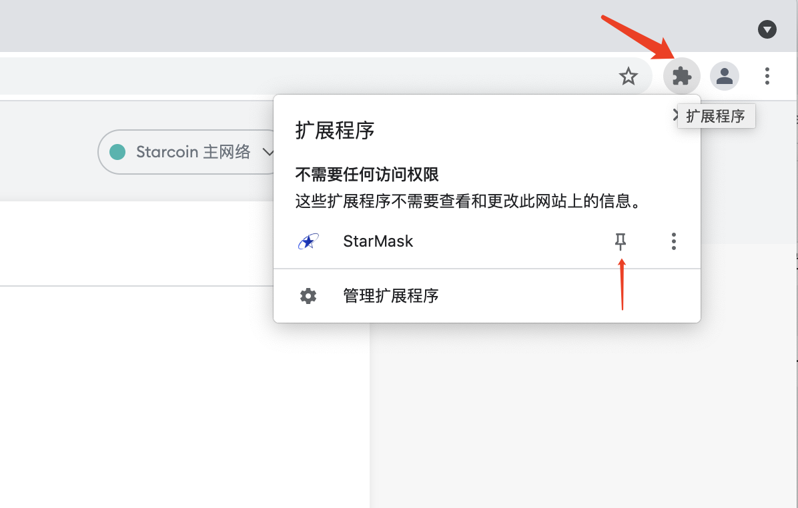
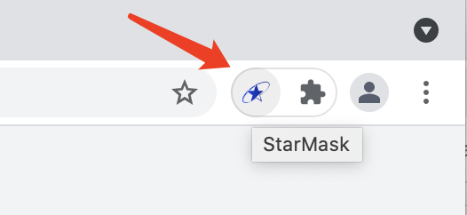

# 安装指南 - Chrome 浏览器

1. 前往 [chrome 网上应用店
](https://chrome.google.com/webstore/detail/starmask/mfhbebgoclkghebffdldpobeajmbecfk/related)

2. 点击 `添加至 Chrome`

    

3. 点击 `开始使用`

    

4. 如果是第一次安装使用，请点击 `创建钱包`

    

5. 点击 `我同意`

    

6. 输入密码，点击 `创建`

    

7. `点击此处显示密语`

    

> 提示:
> - 下载助记词，方便以后通告导入助记词的方式恢复钱包
> - 可以选择 `稍后提醒` 直接跳到 第8步， 以后再根据提示进行备份

8. 点击 `下一步`

    

9. 按顺序输入助记词， 点击 `确认`

    

10. 点击 `全部完成`

    

11. 进入插件钱包主页面(全屏模式)

    
 
12. 进入Starcoin钱包主页面(全屏模式)

    

13. 点击浏览器右上角`扩展程序`图标，选中 `Starcoin` 右侧 图钉

    

14. Starcoin插件的图标会固定出现在浏览器右上角。 
    任何时候单击该图标，都会进入插件钱包主页面(弹窗模式)

    