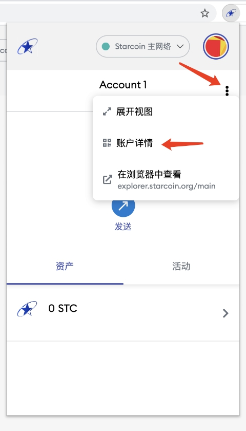
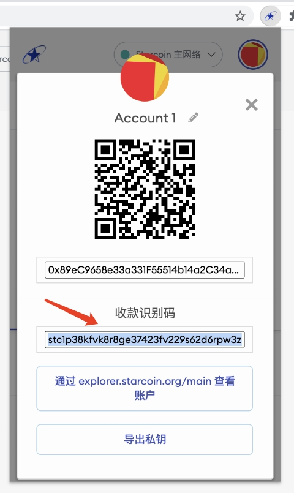
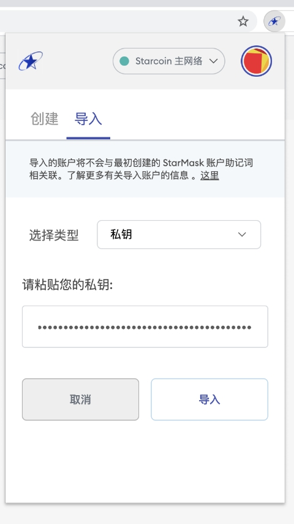
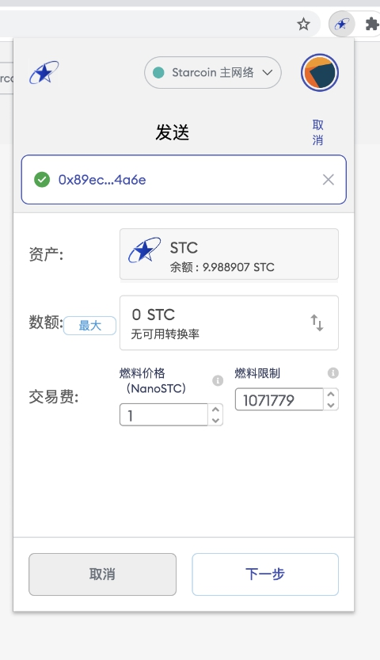
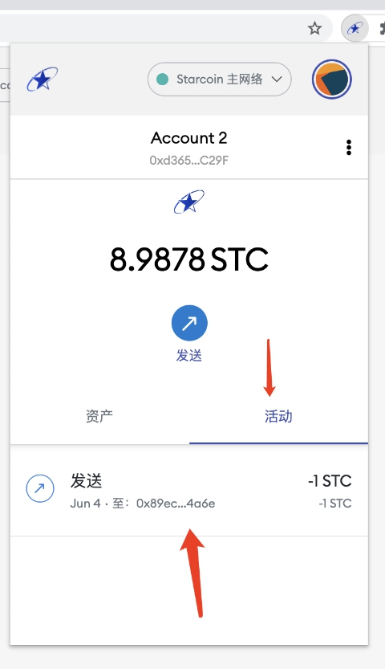
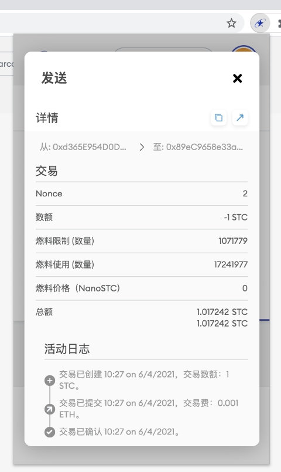
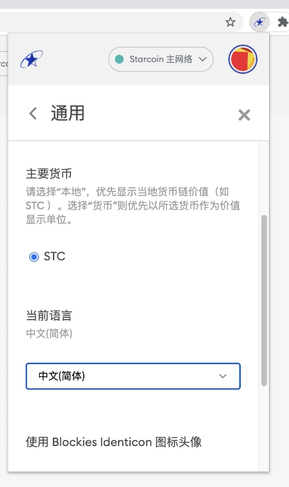
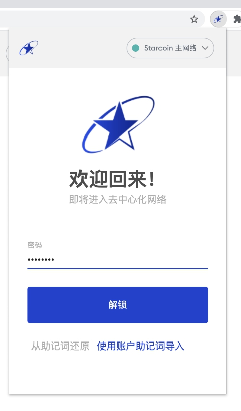

# 使用指南

## 1. 查看账户 Account1 地址和收款识别码，导出私钥
- a 点击 账户名称 Account1 右侧 图标，在弹窗里面选择 `账户详情`
    
    

- b 地址二维码和地址， 收款识别码，和 导出私钥
    
    

## 2. 通过导入私钥创建账户 Account2
- a 点击 右上角头像图标, 在弹窗里面，选择 `导入账户`

    

- b 粘贴私钥，点击 `导入`

    

- c 账户 Account2 导入成功

    

## 3. 通过收款识别码发送STC (Account2 给 Account1 发送1STC)

- a 在 Account2  页面， 点击 `发送`

    

- b 在文本输入框里面粘贴 通过步骤 1b 拷贝的 Account1 收款识别码

    

- c 进入 发送 页面

    

- d 修改 数额 为 1 STC， 点击 `下一步`

    

- e 在发送确认页面，点击 `确认`

    

> 提示: 可以点击左上方的 `编辑`， 返回上一个页面 修改 金额 和 gas费用

- f 发送成功后，Account2 的 余额被扣减 1 STC，点击 `活动` 可以查看发送记录

    

- g 点击交易记录所在行，可以查看交易详情

    

- h 点击 右上方 头像图标，切换账户到 Account1， Account1 余额增加 1 STC

    

## 4. 其他功能
- a  设置 -> 通用 -> 当前语言

    

- b 锁定/解锁

    

    

- c 切换网络

    