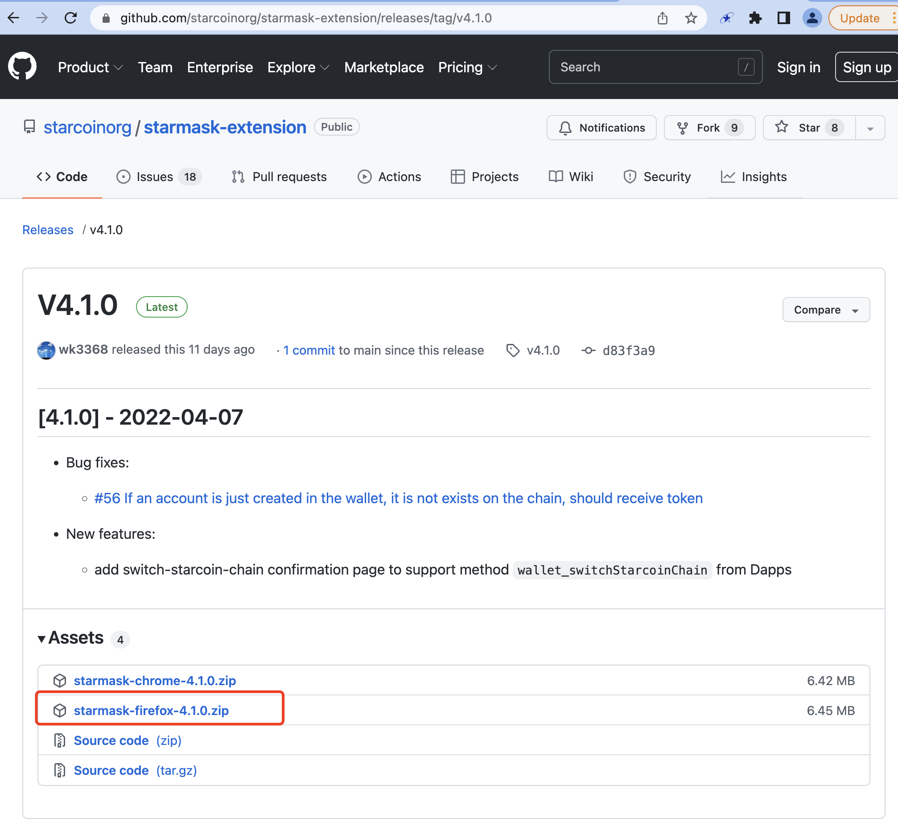
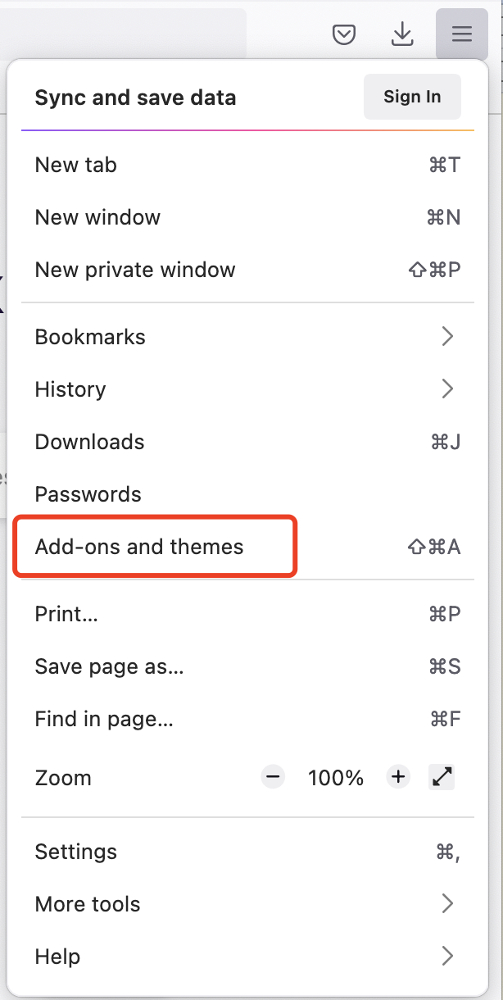
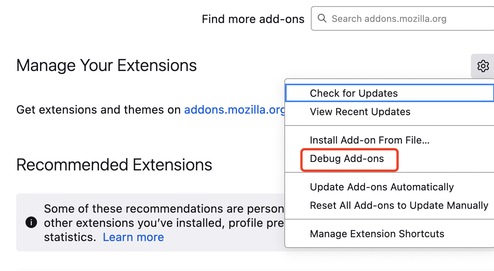
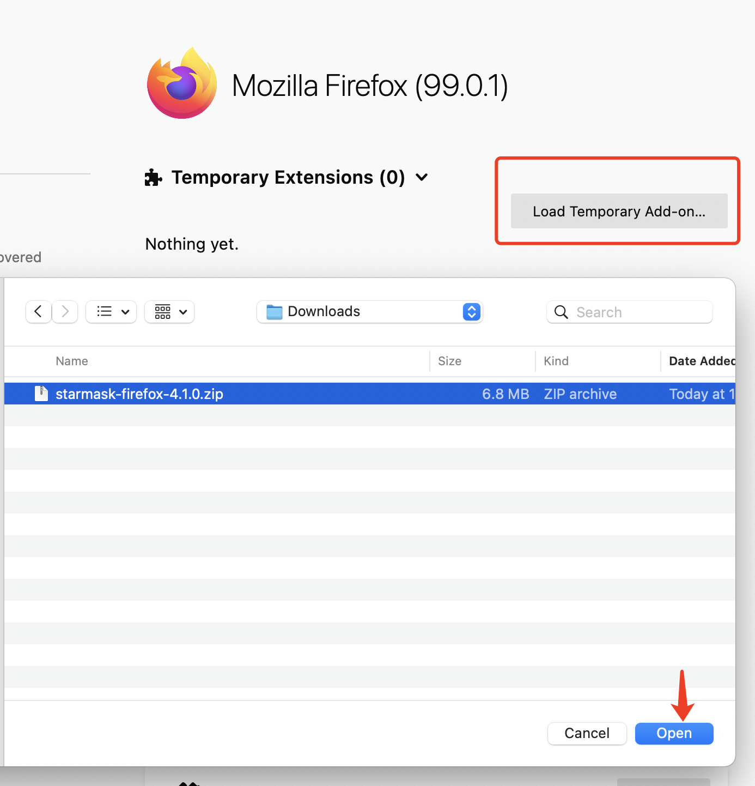
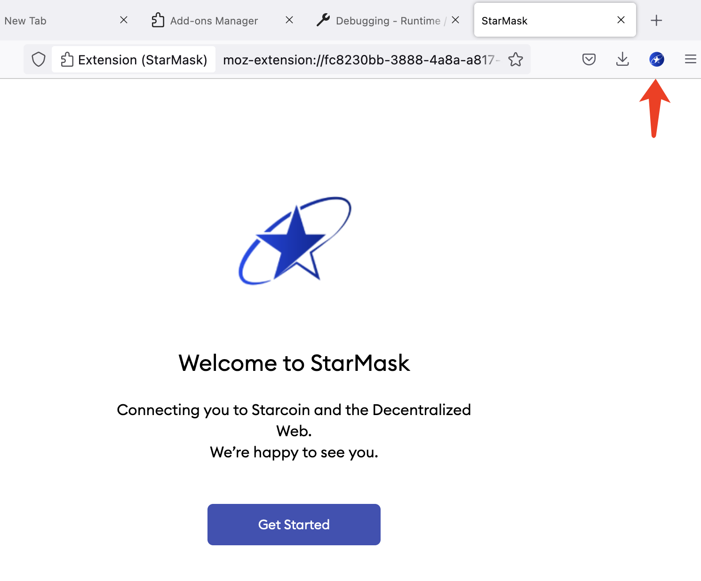
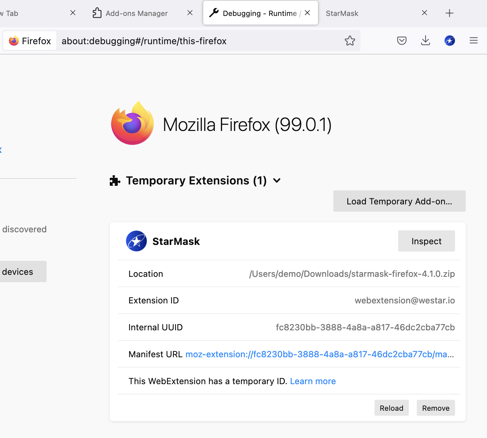

# 安装指南 - Firefox 浏览器

## 一、 通过 `github latest release zip` 安装

1. 前往 [github releases](https://github.com/starcoinorg/starmask-extension/releases)

2. 下载 `Latest release` 对应的 `starmask-firefox-*.zip` 文件
   

3. Firefox -> `Open Application Menu` -> `Add-ons and themes`
   

4. `Manage Your Extensions`
   -> `Tools for all add-ons` -> `Debug Add-ons`
   

5. `Load Tempoary Add-on...` -> Choose your local file: `starmask-firefox-*.zip`
   

6. StarMask 插件安装成功
   

   
